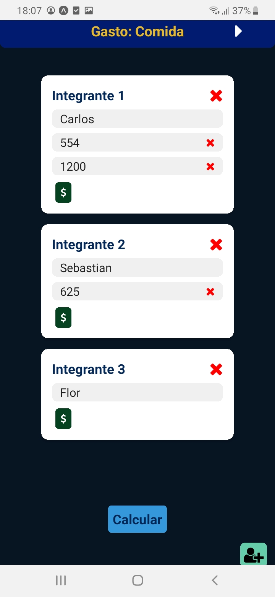
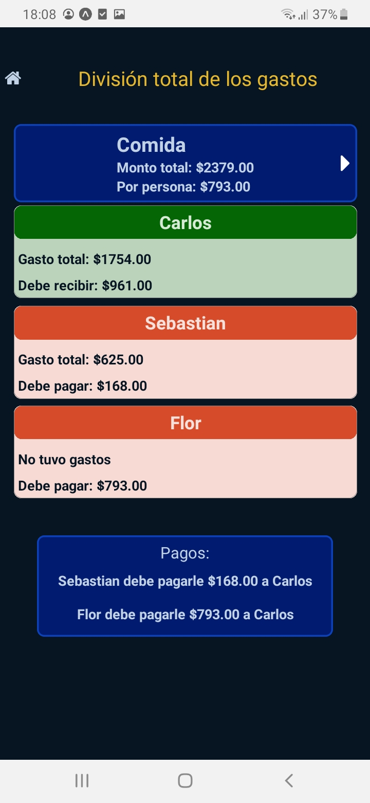

# Calculador gastos
App creada en react native para calcular gastos en reuniones entre distintos numeros de personas.
Inicializada con expo.

## Dependencias

Paquetes extras
``` 
react-navigation/native-stack
```
```
react-navigation/native
```
```
react-native-vector-icons
```

## Acerca del proyecto
Esta app sirve para calcular la división de los gastos entre un número "x" de personas. Esta diseñada para poder calcular distintos gastos en la que los integrantes no sean los mismos, pudiendo dividir cada operacion en el gasto determinado y con los integrantes agregados. Al realizar el cálculo la app ofrece información sobre el total de lo que se gastó, cuánto debería ser la división por persona, cuánto gastó en total cada integrante y cuánto es el monto que debería pagar (en caso de haber gastado menos de lo que debería gastar cada uno) o recibir (en caso de haber gastado de más). Tambien en base a estos datos ofrece información sobre quien y cuanto debería pagar un integrante a otro para saldas las deudas.

### Tecnologías
- [React native] (https://reactnative.dev/)
- [Expo] (https://docs.expo.dev/)

## Screenshots




